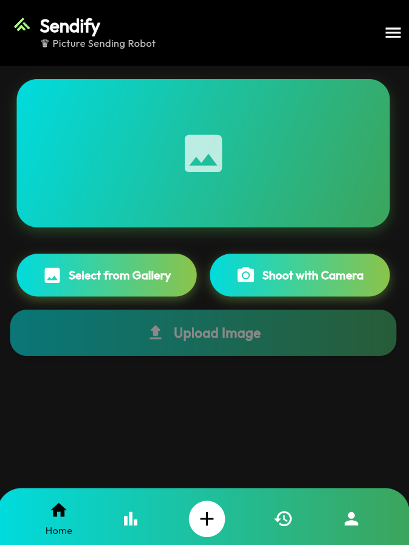
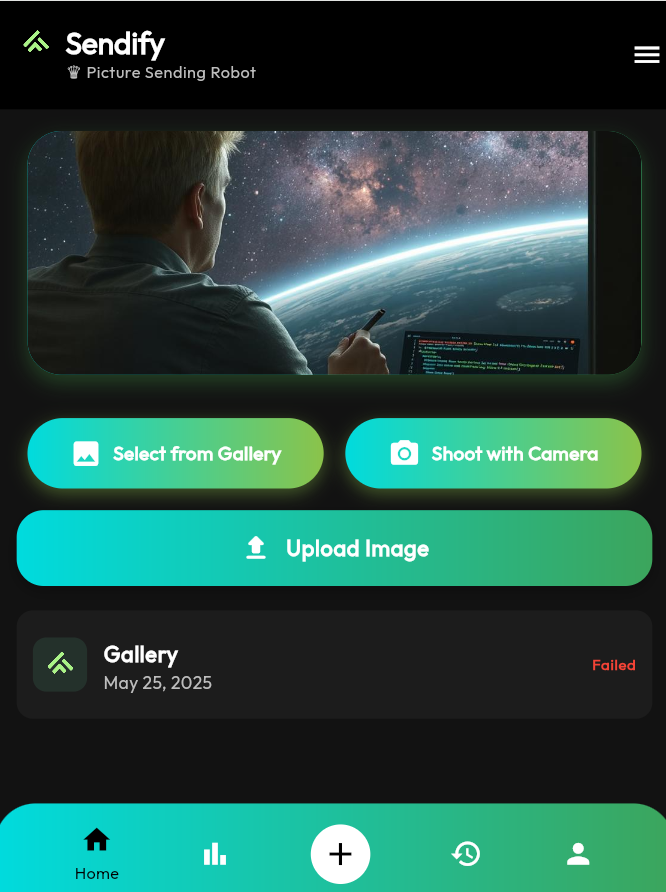

# 🤖 Sendfy-APP - Full-Stack Image Upload Platform

<div align="center">


**Modern Cross-Platform Image Upload Solution**

[](https://flutter.dev)
[](https://dotnet.microsoft.com)
[](https://postgresql.org)

</div>

---

## 📱 Application Preview

<div align="center">

### 🤖 Sendify - Picture Sending Robot in Action

<p align="center">
  
  
  
</p>

</div>

---

## 🌟 Features

### 📸 **Image Upload**
- **Camera Integration** - Capture photos instantly with `image_picker`
- **Gallery Selection** - Choose from existing photos
- **Cross-Platform** - Works on iOS, Android, Web, Windows, Linux, and macOS
- **Real-time Status** - Live upload feedback with success/failure tracking
- **Upload History** - Track all upload attempts with timestamps

### 🎨 **Modern UI/UX**
- **Material Design 3** - Dark theme with custom styling
- **Google Fonts** - Outfit font family for modern typography
- **Gradient Design** - Beautiful teal-to-green color transitions
- **Responsive Layout** - Adapts to all screen sizes
- **Bottom Navigation** - 5-tab navigation with floating action button

### ⚡ **Performance**
- **Async Operations** - Non-blocking multipart HTTP uploads
- **Memory Efficient** - Stream-based file processing
- **Error Handling** - Comprehensive try-catch with user feedback
- **CORS Enabled** - Cross-origin request support

---

## 🏗️ Architecture Overview

```
┌─────────────────┐    HTTPS         ┌──────────────────┐    EF Core    ┌──────────────┐
│   Flutter App   │ ◄──Multipart──►  │ ASP.NET Core API │ ◄──────────►  │ PostgreSQL   │
│                 │    Form Data     │                  │               │   Database   │
│ • Image Picker  │                  │ • Repository     │               │              │
│ • HTTP Client   │                  │ • Clean Arch     │               │ • Images     │
│ • State Mgmt    │                  │ • DI Container   │               │ • Results    │
└─────────────────┘                  └──────────────────┘               └──────────────┘
```

---

## 🛠️ Technology Stack

### 📱 **Frontend (Flutter 3.x)**

**Core Dependencies:**
- **`image_picker: ^1.0.4`** - Camera and gallery access
- **`http: ^1.2.1`** - HTTP client for API communication
- **`google_fonts: ^6.1.0`** - Outfit font family
- **`intl: ^0.18.1`** - Date formatting
- **`http_parser: ^4.0.2`** - MediaType handling
- **`path: ^1.8.3`** - File path utilities

**Architecture:**
- **State Management:** StatefulWidget with setState
- **Theme:** Custom dark theme with Material Design 3
- **Navigation:** Bottom navigation with 5 tabs
- **Platform Support:** iOS, Android, Web, Windows, Linux, macOS

### ⚙️ **Backend (ASP.NET Core)**

**Clean Architecture Layers:**
- **`WebAPI`** - Controllers and presentation layer
- **`Business`** - Services and business logic
- **`Core`** - Interfaces and domain contracts
- **`DataAccess`** - EF Core context and repositories
- **`Entities`** - Domain models

**Key Features:**
- **Entity Framework Core** with PostgreSQL
- **Repository Pattern** implementation
- **Dependency Injection** with built-in container
- **CORS Configuration** for cross-origin requests
- **Multipart File Upload** handling

### 🗄️ **Database (PostgreSQL)**

**Schema Design:**
```sql
Images Table:
- Id (PK)
- Data (bytea) -- Binary image data
- ContentType (varchar) -- MIME type

ImageUploadResults Table:
- Id (PK)
- ImageId (FK) -- One-to-One with Images
- IsSuccess (boolean)
```

---

## 🚀 Quick Start

### Prerequisites
- **Flutter SDK** 3.7.2 or higher
- **.NET Core SDK** 6.0 or higher
- **PostgreSQL** database server

### 📱 Frontend Setup

```bash
# Navigate to frontend directory
cd image_upload_frontend

# Install dependencies
flutter pub get

# Run on web (Chrome)
flutter run -d chrome

# Run on mobile device
flutter run
```

### ⚙️ Backend Setup

```bash
# Navigate to backend directory
cd ImageUploadBackend

# Restore NuGet packages
dotnet restore

# Update connection string in WebAPI/appsettings.json
{
  "ConnectionStrings": {
    "DefaultConnection": "Host=localhost;Database=ImageDb;Username=postgres;Password=your_password"
  }
}

# Create database and tables
dotnet ef migrations add InitialCreate --project DataAccess --startup-project WebAPI
dotnet ef database update --project DataAccess --startup-project WebAPI

# Run the API (HTTPS on port 7070)
dotnet run --project WebAPI
```

---

## 📁 Project Structure

```
📁 Sendfy-APP/
├── 📁 ImageUploadBackend/           # ASP.NET Core Backend
│   ├── 📁 Business/                 # Business Logic Layer
│   │   └── 📁 Services/
│   │       ├── 📄 ImageService.cs
│   │       └── 📄 ImageUploadResultService.cs
│   ├── 📁 Core/                     # Domain Interfaces
│   │   └── 📁 Interfaces/
│   │       ├── 📄 IImageRepository.cs
│   │       └── 📄 IImageUploadResultRepository.cs
│   ├── 📁 DataAccess/               # Data Access Layer
│   │   ├── 📁 Context/
│   │   │   └── 📄 AppDbContext.cs
│   │   └── 📁 Repository/
│   │       ├── 📄 ImageRepository.cs
│   │       └── 📄 ImageUploadResultRepository.cs
│   ├── 📁 Entities/                 # Domain Models
│   │   └── 📁 Concrete/
│   │       ├── 📄 Image.cs
│   │       └── 📄 ImageUploadResult.cs
│   └── 📁 WebAPI/                   # Presentation Layer
│       ├── 📁 Controllers/
│       │   └── 📄 ImageController.cs
│       └── 📄 Program.cs
│
├── 📁 image_upload_frontend/        # Flutter Frontend
│   ├── 📁 lib/
│   │   ├── 📁 core/                 # Core utilities
│   │   │   ├── 📄 constants.dart    # App constants and API URL
│   │   │   ├── 📄 theme.dart        # Dark theme configuration
│   │   │   └── 📄 utils.dart        # Utility functions
│   │   ├── 📁 features/
│   │   │   └── 📁 upload/
│   │   │       ├── 📁 data/
│   │   │       │   └── 📄 models.dart
│   │   │       ├── 📁 presentation/
│   │   │       │   ├── 📁 pages/
│   │   │       │   │   └── 📄 home_page.dart
│   │   │       │   └── 📁 widgets/
│   │   │       │       ├── 📄 action_buttons.dart
│   │   │       │       ├── 📄 image_preview.dart
│   │   │       │       ├── 📄 result_box.dart
│   │   │       │       ├── 📄 status_list.dart
│   │   │       │       └── 📄 upload_button.dart
│   │   │       └── 📁 services/
│   │   │           ├── 📄 image_picker_service.dart
│   │   │           └── 📄 upload_api_service.dart
│   │   ├── 📁 shared/
│   │   │   ├── 📄 bottom_nav.dart   # 5-tab bottom navigation
│   │   │   └── 📄 widgets.dart
│   │   ├── 📁 src/
│   │   │   └── 📄 logo.png          # App logo
│   │   └── 📄 main.dart             # App entry point
│   └── 📄 pubspec.yaml              # Flutter dependencies
│
└── 📄 README.md
```

---

## 🔧 Configuration

### 📱 **Flutter Configuration**

Update API endpoint in `lib/core/constants.dart`:

```dart
class AppConstants {
  static const String apiUploadUrl = "https://localhost:7070/api/Image/upload";
  static const String apiUploadField = "file";
  static const String statusSuccess = "Success";
  static const String statusFailed = "Failed";
}
```

### ⚙️ **Backend Configuration**

Update `WebAPI/appsettings.json`:

```json
{
  "ConnectionStrings": {
    "DefaultConnection": "Host=localhost;Database=ImageDb;Username=postgres;Password=your_password"
  }
}
```

**CORS Configuration** (in Program.cs):
```csharp
builder.Services.AddCors(options =>
{
    options.AddDefaultPolicy(policy =>
    {
        policy.AllowAnyOrigin()
              .AllowAnyHeader()
              .AllowAnyMethod();
    });
});
```

---

## 📊 API Documentation

### **POST** `/api/Image/upload`

Upload an image file to the server.

**Request:**
- **Content-Type:** `multipart/form-data`
- **Field Name:** `file`
- **Supported Types:** All image formats

**Response:**
```
Success: "Success" (200 OK)
Error: "Failed" (500 Internal Server Error)
```

**cURL Example:**
```bash
curl -X POST \
  https://localhost:7070/api/Image/upload \
  -H 'Content-Type: multipart/form-data' \
  -F 'file=@/path/to/image.jpg'
```

---

## 🧪 Testing

### 📱 **Frontend Testing**

```bash
# Run widget tests
flutter test

# Run on different platforms
flutter run -d chrome      # Web
flutter run -d windows     # Windows
flutter run                # Mobile device
```

### ⚙️ **Backend Testing**

```bash
# Run the API
dotnet run --project WebAPI

# Test with Swagger UI
# Navigate to: https://localhost:7070/swagger

# Test multipart upload
# Use Postman or curl with multipart/form-data
```

---

## 🚀 Build & Deployment

### 📱 **Flutter Build**

```bash
# Web build
flutter build web

# Android APK
flutter build apk --release

# iOS build (macOS only)
flutter build ios --release

# Windows build
flutter build windows --release
```

### ⚙️ **Backend Deployment**

```bash
# Production build
dotnet publish WebAPI -c Release -o ./publish

# Run in production
cd publish
dotnet WebAPI.dll
```

---

## 🤝 Contributing

1. **Fork** the repository
2. **Create** a feature branch (`git checkout -b feature/amazing-feature`)
3. **Commit** changes (`git commit -m 'Add amazing feature'`)
4. **Push** to branch (`git push origin feature/amazing-feature`)
5. **Open** a Pull Request

---

## 📄 License

This project is licensed under the **MIT License** - see the [LICENSE](LICENSE) file for details.

---

## 👨‍💻 Author

**Mehmet Eren**
- GitHub: [@Mehmteren](https://github.com/Mehmteren)
- Project: [Sendfy-APP](https://github.com/Mehmteren/Sendfy-APP)

---

## 🙏 Acknowledgments

- **Flutter Team** for the cross-platform framework
- **Microsoft** for .NET Core and Entity Framework
- **PostgreSQL** community for the database system
- **Google Fonts** for the Outfit font family

---

<div align="center">

**Built with ❤️ using Flutter & .NET Core**

⭐ **Star this repo if you found it helpful!** ⭐

</div>
