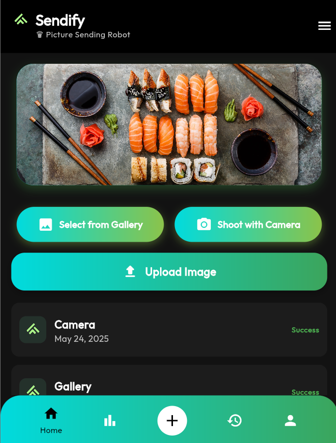

# 🤖 Sendfy-APP - Full-Stack Image Upload Platform

<div align="center">


**Modern Cross-Platform Image Upload Solution**

[](https://flutter.dev)
[](https://dotnet.microsoft.com)
[](https://postgresql.org)

</div>

---

## 📱 Application Preview

> <p align="center">
  
</p>

---

## 🌟 Features

### 📸 **Image Upload**
- **Camera Integration** - Capture photos instantly
- **Gallery Selection** - Choose from existing photos
- **Cross-Platform** - Works on iOS, Android, and Web
- **Real-time Feedback** - Live upload status updates

### 🎨 **Modern UI/UX**
- **Material Design 3** - Contemporary and intuitive interface
- **Gradient Themes** - Beautiful color transitions
- **Responsive Layout** - Adapts to all screen sizes
- **Dark Mode Ready** - Eye-friendly design

### ⚡ **Performance**
- **Async Operations** - Non-blocking UI interactions
- **Efficient File Handling** - Optimized memory usage
- **Fast API Responses** - Quick upload processing
- **Error Handling** - Graceful failure management

---

## 🏗️ Architecture Overview

```
┌─────────────────┐    HTTP/HTTPS     ┌──────────────────┐    EF Core    ┌──────────────┐
│   Flutter App   │ ◄──Multipart───► │ ASP.NET Core API │ ◄──────────► │ PostgreSQL   │
│                 │    Requests       │                  │               │   Database   │
│ • Image Picker  │                   │ • Repository     │               │              │
│ • HTTP Client   │                   │ • Async/Await    │               │ • Images     │
│ • State Mgmt    │                   │ • CORS Enabled   │               │ • Metadata   │
└─────────────────┘                   └──────────────────┘               └──────────────┘
```

---

## 🛠️ Technology Stack

### 📱 **Frontend (Flutter)**
- **Framework:** Flutter 3.x with Dart
- **HTTP Client:** `http` package for multipart requests
- **Image Handling:** `image_picker` for camera/gallery access
- **UI Library:** Material Design 3 with custom gradients
- **State Management:** StatefulWidget with setState pattern
- **Platform Support:** iOS, Android, Web, Desktop

### ⚙️ **Backend (ASP.NET Core)**
- **Framework:** .NET Core 6+ Web API
- **Architecture:** Clean Architecture with Repository pattern
- **Database:** PostgreSQL with Entity Framework Core
- **Async Patterns:** Task-based async/await operations
- **CORS:** Cross-origin request support
- **File Processing:** Multipart form data handling

### 🗄️ **Database (PostgreSQL)**
- **ORM:** Entity Framework Core with Code-First migrations
- **Storage:** Binary image data with metadata
- **Relationships:** Normalized schema design
- **Connection:** Npgsql provider for .NET

---

## 🚀 Quick Start

### Prerequisites
- **Flutter SDK** 3.x or higher
- **.NET Core SDK** 6.0 or higher
- **PostgreSQL** 13+ database server
- **IDE:** VS Code, Visual Studio, or Android Studio

### 📱 Frontend Setup

```bash
# Navigate to frontend directory
cd image_upload_frontend

# Install dependencies
flutter pub get

# Run on web
flutter run -d chrome

# Run on mobile (with device connected)
flutter run
```

### ⚙️ Backend Setup

```bash
# Navigate to backend directory
cd ImageUploadBackend

# Restore packages
dotnet restore

# Update connection string in appsettings.json
# "DefaultConnection": "Host=localhost;Database=ImageUploadDB;Username=your_user;Password=your_password"

# Create and run migrations
dotnet ef migrations add InitialCreate --project DataAccess --startup-project WebAPI
dotnet ef database update --project DataAccess --startup-project WebAPI

# Run the API
dotnet run --project WebAPI
```

---

## 📁 Project Structure

```
📁 Sendfy-APP/
├── 📁 ImageUploadBackend/           # ASP.NET Core Backend
│   ├── 📁 Business/                 # Business Logic Layer
│   │   └── 📁 Services/             # Application services
│   ├── 📁 Core/                     # Domain Layer
│   │   └── 📁 Interfaces/           # Repository interfaces
│   ├── 📁 DataAccess/               # Data Access Layer
│   │   ├── 📁 Context/              # Database context
│   │   └── 📁 Repository/           # Repository implementations
│   ├── 📁 Entities/                 # Domain Entities
│   │   └── 📁 Concrete/             # Entity models
│   └── 📁 WebAPI/                   # Presentation Layer
│       ├── 📁 Controllers/          # API controllers
│       └── 📄 Program.cs            # Application entry point
│
├── 📁 image_upload_frontend/        # Flutter Frontend
│   ├── 📁 lib/                      # Main source code
│   │   ├── 📁 core/                 # Core utilities
│   │   ├── 📁 features/             # Feature modules
│   │   │   └── 📁 upload/           # Image upload feature
│   │   └── 📁 shared/               # Shared components
│   ├── 📁 android/                  # Android-specific files
│   ├── 📁 ios/                      # iOS-specific files
│   ├── 📁 web/                      # Web-specific files
│   └── 📄 pubspec.yaml              # Flutter dependencies
│
└── 📄 README.md                     # Project documentation
```

---

## 🔧 Configuration

### 📱 **Flutter Configuration**

Update the API endpoint in `lib/core/constants.dart`:

```dart
class AppConstants {
  static const String apiUploadUrl = "https://your-api-domain.com/api/Image/upload";
  // For local development:
  // static const String apiUploadUrl = "http://localhost:7070/api/Image/upload";
}
```

### ⚙️ **Backend Configuration**

Update `appsettings.json` in WebAPI project:

```json
{
  "ConnectionStrings": {
    "DefaultConnection": "Host=localhost;Database=ImageUploadDB;Username=your_user;Password=your_password"
  },
  "Logging": {
    "LogLevel": {
      "Default": "Information",
      "Microsoft.AspNetCore": "Warning"
    }
  }
}
```

---

## 📊 API Endpoints

### **POST** `/api/Image/upload`

Upload an image file to the server.

**Request:**
- **Content-Type:** `multipart/form-data`
- **Field:** `file` (image file)

**Response:**
```json
{
  "status": "Success",
  "message": "Image uploaded successfully"
}
```

**cURL Example:**
```bash
curl -X POST \
  http://localhost:7070/api/Image/upload \
  -H 'Content-Type: multipart/form-data' \
  -F 'file=@/path/to/your/image.jpg'
```

---

## 🧪 Testing

### 📱 **Frontend Testing**

```bash
# Run widget tests
flutter test

# Run integration tests
flutter drive --target=test_driver/app.dart
```

### ⚙️ **Backend Testing**

```bash
# Run unit tests
dotnet test

# Test API endpoints with Swagger
# Navigate to: http://localhost:7070/swagger
```

---

## 🚀 Deployment

### 📱 **Flutter Deployment**

```bash
# Build for web
flutter build web

# Build for Android
flutter build apk --release

# Build for iOS
flutter build ios --release
```

### ⚙️ **Backend Deployment**

```bash
# Publish for production
dotnet publish -c Release -o ./publish

# Docker deployment (optional)
docker build -t sendfy-api .
docker run -p 8080:80 sendfy-api
```

---

## 🤝 Contributing

1. **Fork** the repository
2. **Create** a feature branch (`git checkout -b feature/amazing-feature`)
3. **Commit** changes (`git commit -m 'Add amazing feature'`)
4. **Push** to branch (`git push origin feature/amazing-feature`)
5. **Open** a Pull Request

---

## 📄 License

This project is licensed under the **MIT License** - see the [LICENSE](LICENSE) file for details.

---

## 👨‍💻 Author

**Mehmet Eren**
- GitHub: [@Mehmteren](https://github.com/Mehmteren)
- Project: [Sendfy-APP](https://github.com/Mehmteren/Sendfy-APP)

---

## 🙏 Acknowledgments

- **Flutter Team** for the amazing cross-platform framework
- **Microsoft** for the robust .NET Core platform
- **PostgreSQL** community for the reliable database system
- **Material Design** for the beautiful UI guidelines

---

<div align="center">

**Built with ❤️ using Flutter & .NET Core**

⭐ **Star this repo if you found it helpful!** ⭐

</div>
